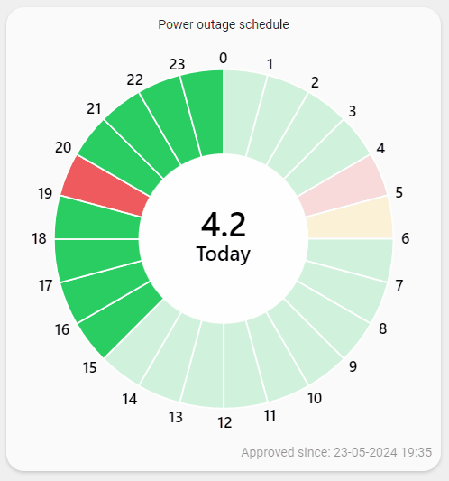
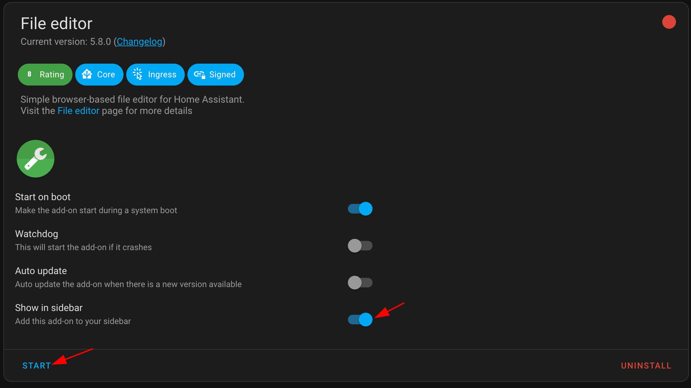
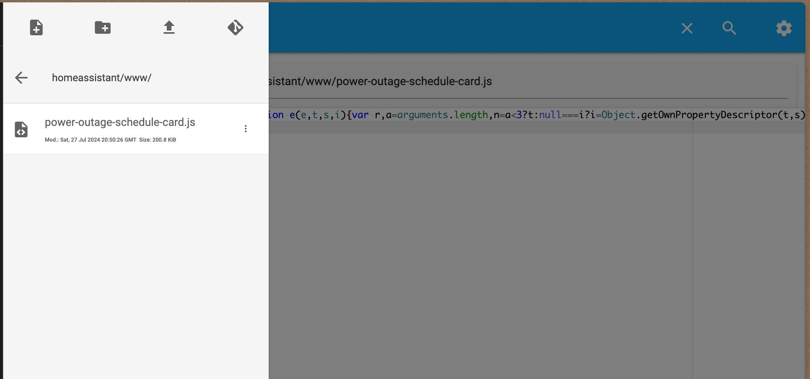
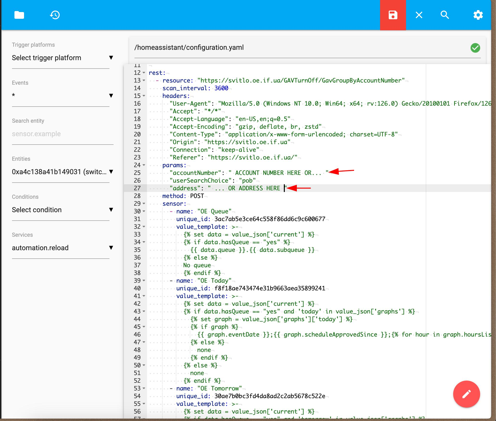
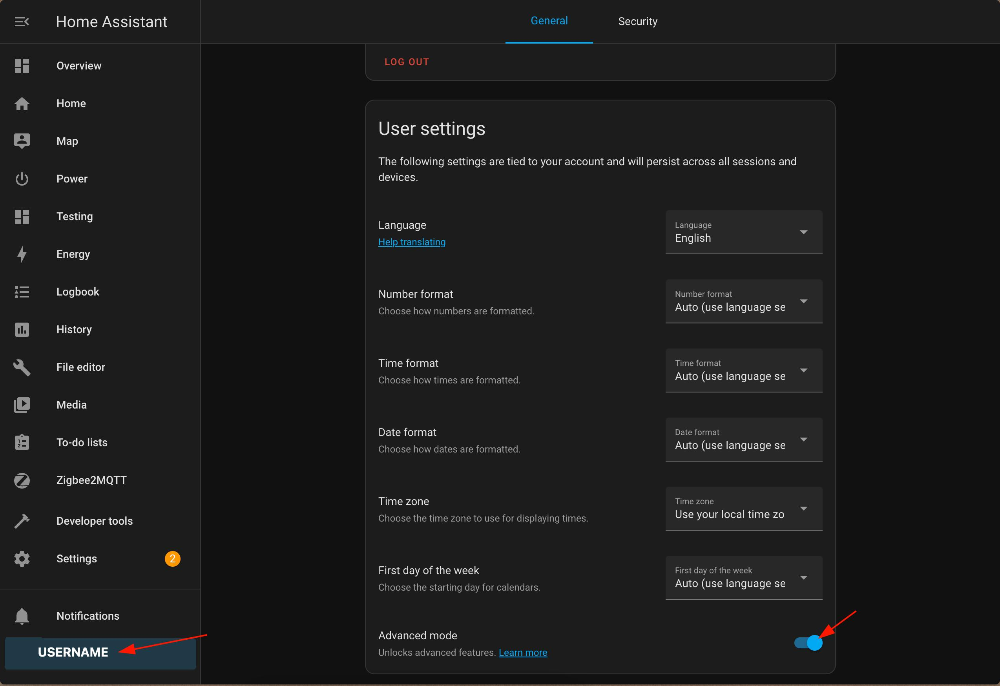
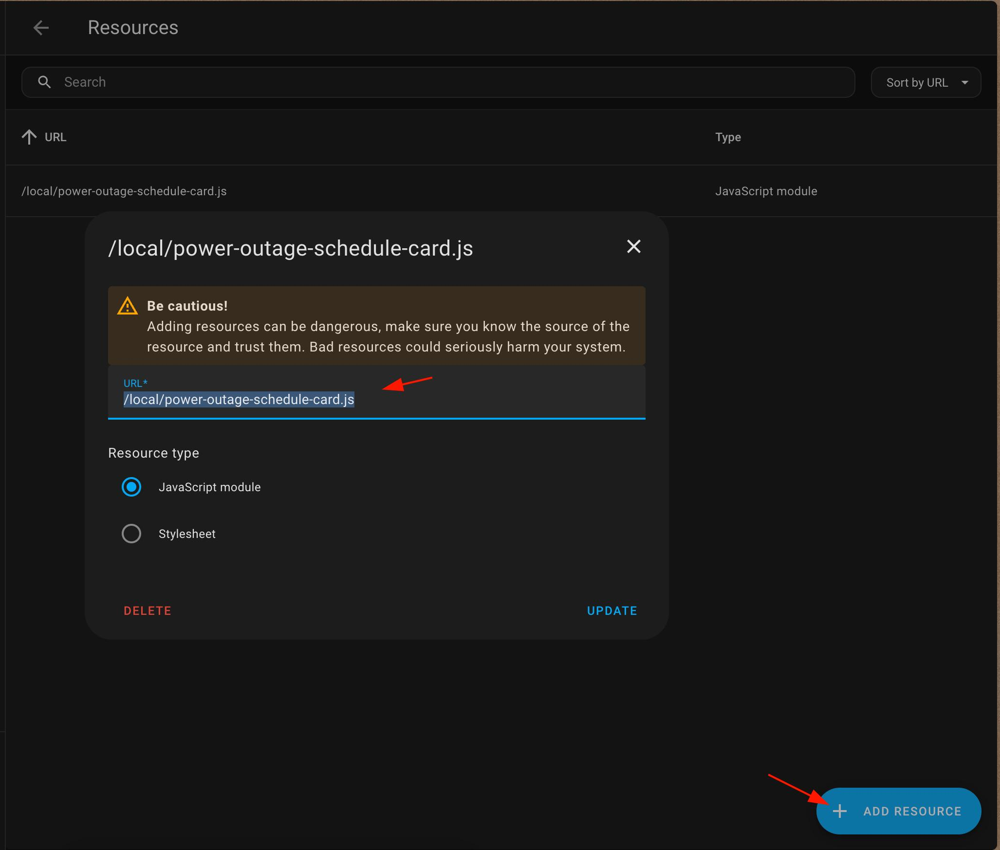
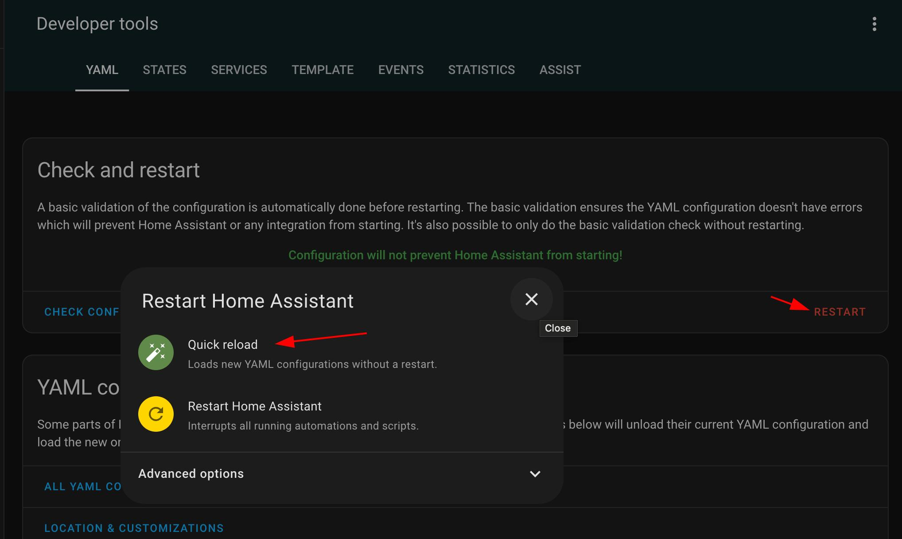
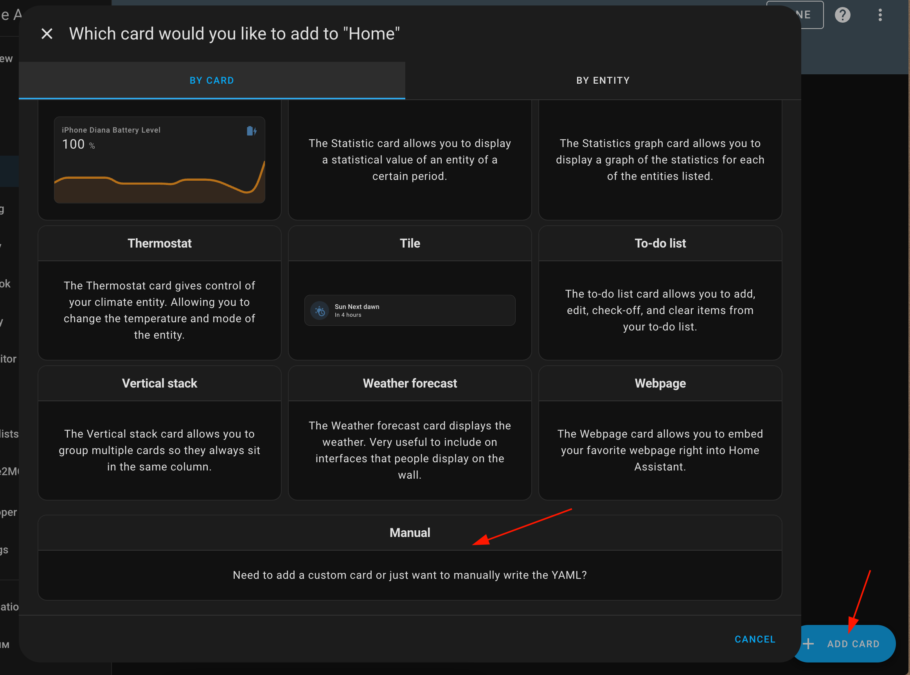
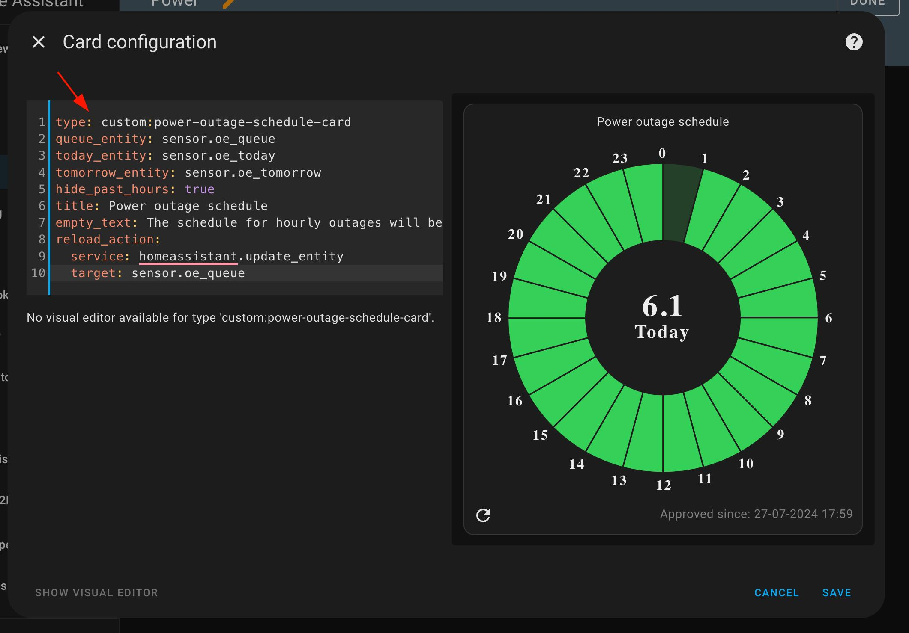

# Power outage schedule card

Power outage schedule card for Home Assistant. The card is designed to work with the information provided by svitlo.oe.if.ua (see data retrieval example). It shows the schedule for today and tomorrow (if provided).



## Installation Guide

1. **Install "File editor" addon in HA**
   
    Go to Settings -> Add-ons -> ADD-ON STORE <br>
    Find "File editor" and intsall add-on <br>
    Start the add-on and toggle "Show in sidebar"
    <details>
    <summary>Screenshot</summary>
    
    </details>

2. **Install the module**
   
    Go to "File editor" on the sidebar and choose "Browse Filesystem" in the top left corner. <br>
    Create a *www* directory if you don't have one and a *power-outage-schedule-card.js* file inside it. <br>
    Copy the code from this repository's [dist/power-outage-schedule-card.js](dist/power-outage-schedule-card.js) to the newly created file. Save the changes.
    <details>
    <summary>Screenshot</summary>
    
    </details>

3. **Configure the sensors**
   
    Go to "File editor" and open the configuration.yaml file and append the code from [Data retrieval example](#data-retrieval-example) <br>
    Don't forget to fill your address or personal account number in the params.
    <details>
    <summary>Screenshot</summary>
    
    </details>

4. **Turn on the advanced mode**
   
    Go to a "User settings" and toggle "Advanced mode"
    <details>
    <summary>Screenshot</summary>
    
    </details>
   
5. **Add a new resource**

    Go to a Settings -> Dashboards, press the ⋮ menu in the top right corner and choose "Resources". <br>
    Press the "Add resource" button and add a Javascript module resource with a URL */local/power-outage-schedule-card.js*
    <details>
    <summary>Screenshot</summary>
    
    </details>
   
6. **Reload configuration**
   
    Go to "Developer tools", choose "Restart" and "Quick reload"
    <details>
    <summary>Screenshot</summary>
    
    </details>
   
7. **Configure the card** 
   
    Open a desired dashboard, press on "Add card" and choose "Manual".
    Copy and paste the code from [Card configuration example](#card-configuration-example) <br>
    <details>
    <summary>Screenshot</summary>
    
    
    </details>

## Card configuration example

```yaml
type: custom:power-outage-schedule-card
queue_entity: sensor.oe_queue
today_entity: sensor.oe_today
tomorrow_entity: sensor.oe_tomorrow
hide_past_hours: true
title: Power outage schedule
empty_text: The schedule for hourly outages will be published by the end of the day.
reload_action:
  service: homeassistant.update_entity
  target: sensor.oe_queue
```

## Data retrieval example
> [!TIP]
> You can use your address or personal account number to fetch the actual data about power outages:
> 
> Put your oblenergo personal account number in __*accountNumber*__ param <br>
> OR <br>
> Put your address in format "Івано-Франківськ,Індустріальна,32" in __*address*__ param
```yaml
rest:
  - resource: "https://svitlo.oe.if.ua/GAVTurnOff/GavGroupByAccountNumber"
    scan_interval: 3600
    headers:
      "User-Agent": "Mozilla/5.0 (Windows NT 10.0; Win64; x64; rv:126.0) Gecko/20100101 Firefox/126.0"
      "Accept": "*/*"
      "Accept-Language": "en-US,en;q=0.5"
      "Accept-Encoding": "gzip, deflate, br, zstd"
      "Content-Type": "application/x-www-form-urlencoded; charset=UTF-8"
      "Origin": "https://svitlo.oe.if.ua"
      "Connection": "keep-alive"
      "Referer": "https://svitlo.oe.if.ua/"
    params:
      "accountNumber": ""
      "userSearchChoice": "pob"
      "address": ""
    method: POST
    sensor:
    - name: "OE Queue"
      unique_id: 3ac7ab5e3ce64c558f86dd6c9c600677
      value_template: >-
        
        
          {{ data.queue }}.{{ data.subqueue }}
        
        No queue
        
    - name: "OE Today"
      unique_id: f8f18ae743474e31b9663aea35899241
      value_template: >-
        
        
          
          
            {{ graph.eventDate }};{{ graph.scheduleApprovedSince }};{{ (hour.hour | int) - 1 }}:{{ hour.electricity }};
          
            none
          
        
          none
        
    - name: "OE Tomorrow"
      unique_id: 30ae7b0bc3fd4da8ad2c2ab5678c522e
      value_template: >-
        
        
          
          
            {{ graph.eventDate }};{{ graph.scheduleApprovedSince }};{{ (hour.hour | int) - 1 }}:{{ hour.electricity }};
          
            none
          
        
          none
        
```